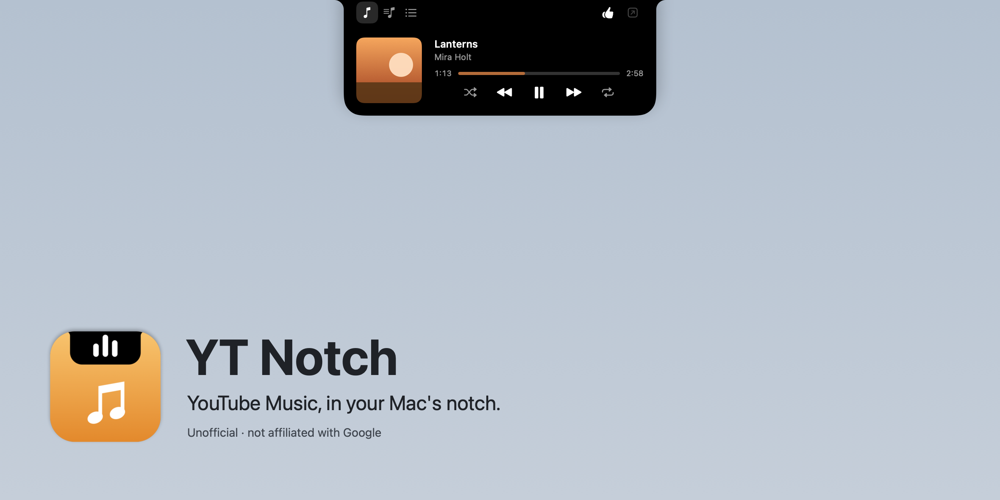
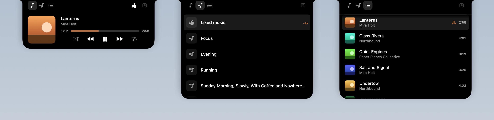

# YT Notch



A free, open-source Mac app that turns the notch into a YouTube Music player. On a MacBook with a notch it opens out of the notch itself; on any other screen it draws a notch-shaped pill at the top centre. Hover it to see what's playing, change songs, start a playlist or jump ahead in Up next.

> **Unofficial.** Not affiliated with, endorsed by or sponsored by Google or YouTube. YouTube Music is a trademark of Google LLC.

You sign in on Google's own page, and the app plays the real site, unmodified, in a window of its own. A small script reads what's playing and presses the site's own controls. There's no ad blocking, no downloading, and no use of Google's internal API.

> **Status:** pre-release. It works end to end; the first public release is on its way.



## Install

1. Download the latest `YT-Notch-….dmg` from [Releases](https://github.com/kasra-r77/yt-notch/releases).
2. Open it and drag **YT Notch** to **Applications**.
3. Open YT Notch from Applications. The first time, macOS stops it, because the app isn't notarised by Apple (that takes a paid developer account):
   1. Close the message macOS shows.
   2. Open **System Settings › Privacy & Security** and scroll down to **Security**, where it says "YT Notch was blocked".
   3. Click **Open Anyway**, confirm with your password or Touch ID, then click **Open**.

   You only do this once. If you prefer Terminal: `xattr -dr com.apple.quarantine "/Applications/YT Notch.app"`, then open the app.

YT Notch needs macOS 14 or later, on Apple silicon or Intel.

## Sign in

The first time it opens, YT Notch shows its window on YouTube Music, with a bar saying "Sign in to YouTube Music to start."

1. Click **Sign in** on the site and sign in on Google's page, two-step check included, as in Safari. YT Notch never sees your password; the sign-in is kept in the app's own web storage, the way Safari keeps it.
2. When the bar says "You're signed in", click **Close Window**. The music doesn't stop when the window closes.
3. Play something. To search or browse, open the window again from the menu bar icon › **Open YT Notch Window**.

## Use

- **The notch:** hover it to open. **Playing** has the controls, like and the progress bar; **Playlists** starts one of your playlists; **Up next** jumps to a song in the queue. Move the pointer away and it closes.
- **Screens without a notch** get a pill at the top centre, showing the song's title and a progress line. It moves aside rather than cover other apps' menu bar icons.
- **Media keys, the Touch Bar, headphone buttons and Control Centre** play, pause and skip, as for any music app.
- **The menu bar icon** opens the window, Settings (which displays show a notch, and opening at login) and Copy Diagnostics. A dot on it means something needs you: signing in, no connection, or a player that needs an update.

## If something goes wrong

- **"No connection":** YT Notch keeps trying on its own; **Try Again** in the menu tries at once.
- **"Player needs an update":** the site changed in a way the app doesn't understand yet. Music still plays in the window. Please open an issue with the **Player stopped working** template and paste **Copy Diagnostics** from the menu. It holds versions, the player's health and the app's recent log, and nothing from your account or what you listen to.
- Anything else: open an issue with the **Bug report** template.

## Privacy

The only network traffic is the site in YT Notch's window, plus, once updates arrive, a check for new versions. The app keeps no record of what you play, has no analytics, and logs only states and errors.

## Build from source

You need Xcode 16 or later and [XcodeGen](https://github.com/yonaskolb/XcodeGen) (`brew install xcodegen`).

```bash
xcodegen generate
xcodebuild -scheme YTNotch build
```

The Xcode project is generated from `project.yml` and is not committed. The app is `YT Notch.app` under Xcode's DerivedData; open `YTNotch.xcodeproj` in Xcode to run it from there.

### Running a development build

A development build plays the site like a release, and its menu adds Debug › Notch State, which forces each notch state for review.

For development and demos it can run on canned tracks instead, with no account or network:

```bash
defaults write io.github.kasra-r77.ytnotch engine fake
```

To go back to the site, run `defaults delete io.github.kasra-r77.ytnotch engine`.

The app logs to the system log under one subsystem. To watch what the web player does, including its recovery steps:

```bash
log stream --level info --predicate 'subsystem == "io.github.kasra-r77.ytnotch"'
```

### Releases and updates

To build the disk image a release ships, run `scripts/make-dmg.sh`; it writes `dist/YT-Notch-<version>.dmg`, laid out as D6 has it when `create-dmg` is installed (`brew install create-dmg`). Pushing a version tag such as `v0.1.0` makes the Release workflow build it and attach it to a GitHub release.

Updates come through [Sparkle](https://sparkle-project.org). The app reads `appcast.xml` from the latest release once a day, and Check for Updates… in its menu checks at once. The update check stays off until the update key exists. To set it up, once (the tools arrive with the first `scripts/make-dmg.sh` run):

1. Make the key pair. Sparkle keeps the private key in your login keychain and prints the public key:

   ```bash
   build/release/SourcePackages/artifacts/sparkle/Sparkle/bin/generate_keys
   ```

2. Put the public key in `project.yml` as `SUPublicEDKey` and commit it.
3. Give the private key to the Release workflow, then delete the exported copy:

   ```bash
   build/release/SourcePackages/artifacts/sparkle/Sparkle/bin/generate_keys -x sparkle-key.txt
   gh secret set SPARKLE_PRIVATE_KEY < sparkle-key.txt
   rm sparkle-key.txt
   ```

4. Keep a backup of the private key, for example in your password manager. Without it, installed copies can't take another update.

For each release, raise `MARKETING_VERSION` and `CURRENT_PROJECT_VERSION` in `project.yml` (Sparkle compares the build number), then push the tag `v<version>`. The release gets a signed `appcast.xml` beside the image, and installed copies find it within a day.

## Test

```bash
swift test --package-path YTNotchKit
```

## Layout

| Path | What |
|---|---|
| `App/` | The thin app target, which only wires the modules together |
| `YTNotchKit/` | The Swift package: `PlayerCore`, `WebPlayer`, `NotchUI`, `SystemMedia` |
| `docs/design.md` | How the app looks and behaves |
| `docs/design/brand/` | The icon and disk image, and the script that draws them |

Contributors and coding agents: read [CONTRIBUTING.md](CONTRIBUTING.md) and [AGENTS.md](AGENTS.md) first.

## License

[Apache License 2.0](LICENSE). You may use, change and share the code, including in your own apps. If you reuse it, keep the [LICENSE](LICENSE) and [NOTICE](NOTICE) files with it, and say which files you changed. NOTICE credits YT Notch.

The app includes [Sparkle](https://sparkle-project.org) under the MIT License; see [THIRD_PARTY_NOTICES.txt](THIRD_PARTY_NOTICES.txt).
